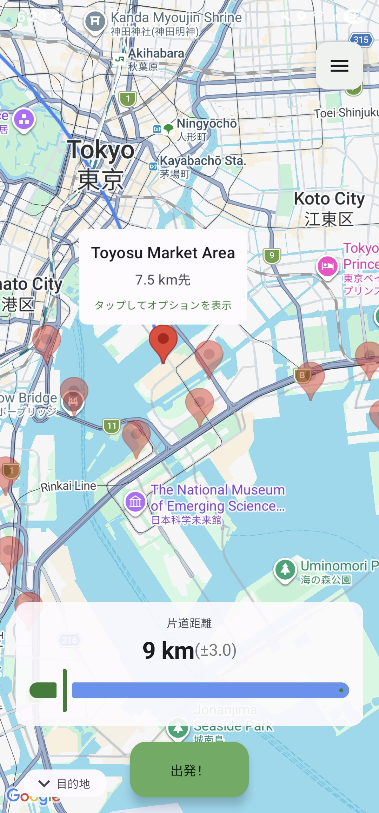
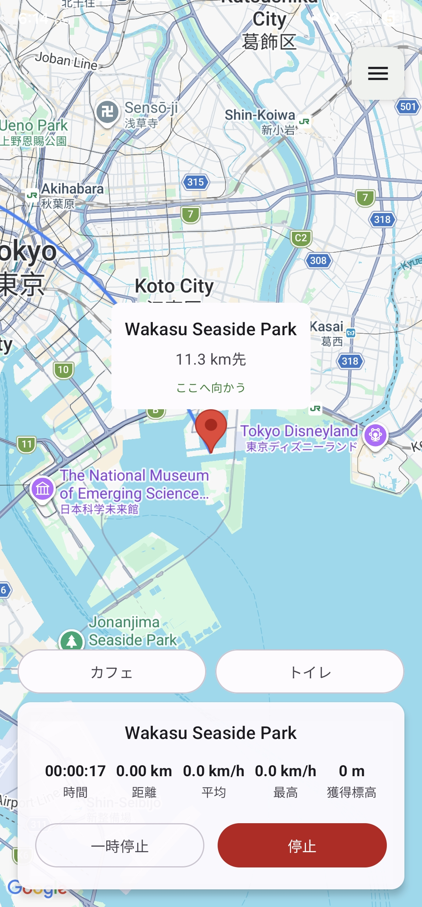
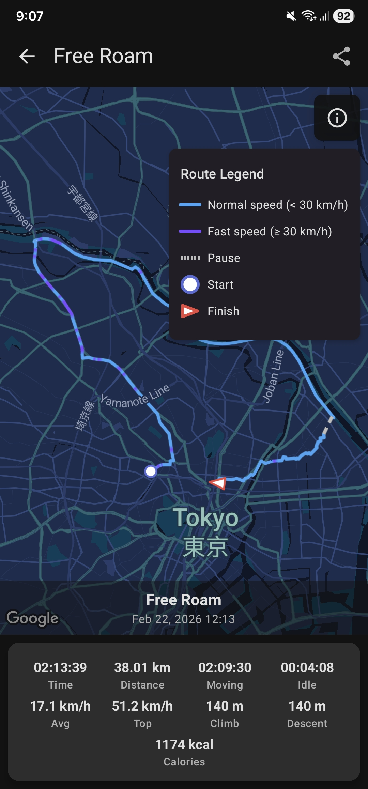

# CyclingAssistant

An Android app that helps cyclists discover cycling destinations, track sessions in real time, connect BLE power meters, and review ride history.

  
  
  
  
  
  

## Features

- **Session tracking** — foreground service with real-time stats, notification controls, and ride sharing
- **Power meter** — BLE connection for live wattage, cadence, and energy tracking
- **Destination discovery** — randomized cycling POIs based on proximity
- **Configurable stats** — choose which statistics to display during sessions
- **Nutrition tracking** — reminders and intake logging linked to sessions
- **Localization** — English, Russian, Japanese

## Under the Hood

- **Multi-module Clean Architecture** — 40+ Gradle modules with bridge pattern for cross-feature communication
- **Jetpack Compose** — Material 3, light/dark theme, debounced interactions
- **Hilt DI** — compile-time dependency injection with qualifier-based scoping
- **Baseline Profiles** — AOT-compiled startup and critical user journey paths
- **Kalman filter** — GPS smoothing with acceleration clamping and median speed buffer
- **SQLCipher** — encrypted Room database in release builds
- **Screenshot testing** — Roborazzi-powered visual regression tests with golden image comparison
- **CI/CD** — automated testing, screenshot verification, baseline profiles, signed releases, coverage badges

## Quick Start

See the [Setup Guide](https://koflox.github.io/cycling-assistant/product/setup/) to get up and running.

## Documentation

Full documentation is available at the [docs site](https://koflox.github.io/cycling-assistant/), including architecture details, feature guides, and contribution instructions.

## License

This project is dual-licensed:
- Free for non-commercial and educational use
- Commercial use requires a separate license
- Use of this code for training AI/ML models is explicitly prohibited

See [LICENSE](LICENSE) for details.
