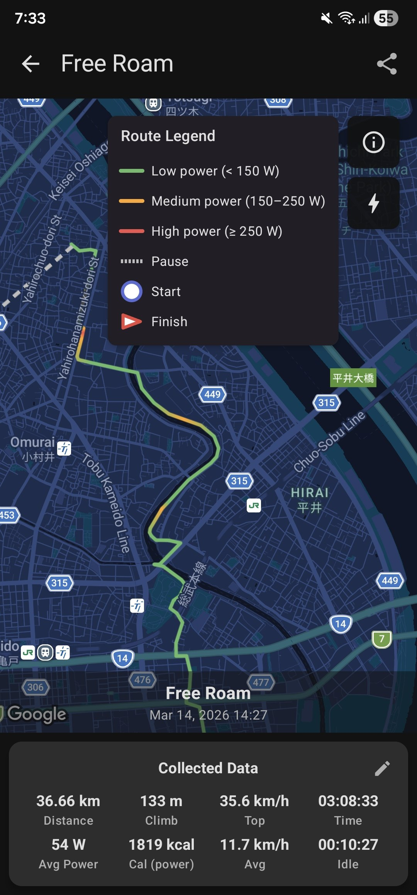
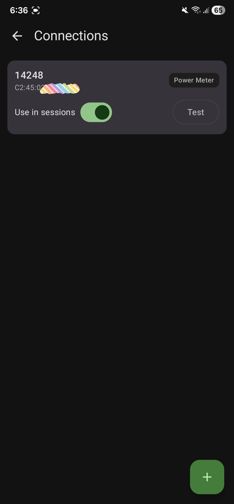

# CyclingAssistant

An Android app that helps cyclists discover cycling destinations, track sessions in real time, connect BLE power meters, and review ride history.

  
  
  

> More screenshots and videos in the [Showcase](https://koflox.github.io/cycling-assistant/product/showcase/).

## Features

- **Session tracking** — foreground service with real-time stats, notification controls, and ride sharing
- **Power meter** — BLE connection for live wattage, cadence, and energy tracking
- **Destination discovery** — randomized cycling POIs based on proximity
- **Configurable stats** — choose which statistics to display during sessions
- **Nutrition tracking** — reminders and intake logging linked to sessions
- **Strava sync** — OAuth 2.0 connect, automatic GPX upload of completed sessions, per-session sync status
- **Localization** — English, Russian, Japanese

## Under the Hood

- **Multi-module Clean Architecture** — 60+ Gradle modules with bridge pattern for cross-feature communication; large features split into bounded sub-modules (e.g., `feature/session/{domain, data, tracking, completion, share, history, stats-display, route-render, init, nav-graph}`)
- **Jetpack Compose** — Material 3, light/dark theme, debounced interactions
- **Hilt DI** — compile-time dependency injection with qualifier-based scoping; `init` modules bridge pure-Kotlin domain code into the Hilt graph
- **Ktor + WorkManager** — Strava REST + OAuth 2.0 with bearer auto-refresh, background upload via Hilt-Work workers
- **Baseline Profiles** — AOT-compiled startup and critical user journey paths
- **Kalman filter** — GPS smoothing with acceleration clamping and median speed buffer
- **SQLCipher** — encrypted Room database in release builds
- **Screenshot testing** — Roborazzi-powered visual regression tests with golden image comparison
- **CI/CD** — automated testing, screenshot verification, baseline profiles, signed releases, coverage badges; module graph regenerated and pushed back into open PRs

## Quick Start

See the [Setup Guide](https://koflox.github.io/cycling-assistant/product/setup/) to get up and running.

## Documentation

Full documentation is available at the [docs site](https://koflox.github.io/cycling-assistant/), including architecture details, feature guides, and contribution instructions.

## License

This project is dual-licensed:
- Free for non-commercial and educational use
- Commercial use requires a separate license
- Use of this code for training AI/ML models is explicitly prohibited

See [LICENSE](LICENSE) for details.
