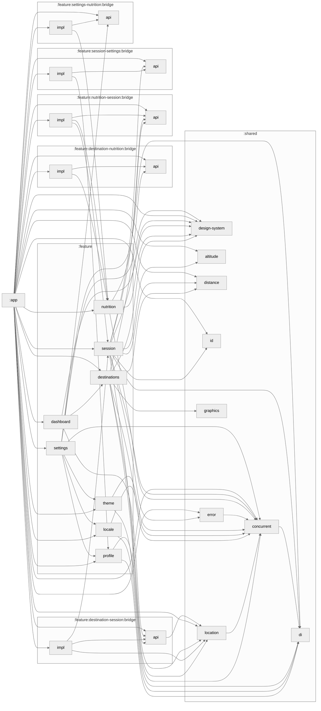

# Module Dependency Graph

```mermaid
%%{
  init: {
    'theme': 'neutral'
  }
}%%

graph LR
  subgraph :feature
    :feature:settings["settings"]
    :feature:theme["theme"]
    :feature:locale["locale"]
    :feature:profile["profile"]
    :feature:dashboard["dashboard"]
    :feature:destinations["destinations"]
    :feature:nutrition["nutrition"]
    :feature:session["session"]
  end
  subgraph :feature:destination-nutrition:bridge
    :feature:destination-nutrition:bridge:api["api"]
    :feature:destination-nutrition:bridge:impl["impl"]
  end
  subgraph :feature:destination-session:bridge
    :feature:destination-session:bridge:api["api"]
    :feature:destination-session:bridge:impl["impl"]
  end
  subgraph :feature:nutrition-session:bridge
    :feature:nutrition-session:bridge:api["api"]
    :feature:nutrition-session:bridge:impl["impl"]
  end
  subgraph :feature:session-settings:bridge
    :feature:session-settings:bridge:api["api"]
    :feature:session-settings:bridge:impl["impl"]
  end
  subgraph :feature:settings-nutrition:bridge
    :feature:settings-nutrition:bridge:api["api"]
    :feature:settings-nutrition:bridge:impl["impl"]
  end
  subgraph :shared
    :shared:location["location"]
    :shared:concurrent["concurrent"]
    :shared:design-system["design-system"]
    :shared:di["di"]
    :shared:altitude["altitude"]
    :shared:distance["distance"]
    :shared:id["id"]
    :shared:error["error"]
    :shared:graphics["graphics"]
  end
  :feature:destination-session:bridge:api --> :shared:location
  :feature:settings --> :feature:theme
  :feature:settings --> :feature:locale
  :feature:settings --> :feature:profile
  :feature:settings --> :feature:settings-nutrition:bridge:api
  :feature:settings --> :shared:concurrent
  :feature:settings --> :shared:design-system
  :feature:settings --> :shared:di
  :app --> :feature:dashboard
  :app --> :feature:destination-nutrition:bridge:api
  :app --> :feature:destination-nutrition:bridge:impl
  :app --> :feature:destination-session:bridge:api
  :app --> :feature:destination-session:bridge:impl
  :app --> :feature:destinations
  :app --> :feature:locale
  :app --> :feature:nutrition
  :app --> :feature:nutrition-session:bridge:api
  :app --> :feature:nutrition-session:bridge:impl
  :app --> :feature:profile
  :app --> :feature:session
  :app --> :feature:session-settings:bridge:api
  :app --> :feature:session-settings:bridge:impl
  :app --> :feature:settings
  :app --> :feature:settings-nutrition:bridge:api
  :app --> :feature:settings-nutrition:bridge:impl
  :app --> :feature:theme
  :app --> :shared:altitude
  :app --> :shared:concurrent
  :app --> :shared:design-system
  :app --> :shared:distance
  :app --> :shared:id
  :app --> :shared:location
  :app --> :shared:error
  :feature:nutrition-session:bridge:impl --> :feature:nutrition
  :feature:nutrition-session:bridge:impl --> :feature:nutrition-session:bridge:api
  :feature:nutrition-session:bridge:impl --> :feature:session
  :feature:session --> :shared:altitude
  :feature:session --> :shared:concurrent
  :feature:session --> :shared:design-system
  :feature:session --> :shared:di
  :feature:session --> :shared:distance
  :feature:session --> :shared:error
  :feature:session --> :shared:id
  :feature:session --> :shared:location
  :feature:session --> :feature:nutrition-session:bridge:api
  :feature:session --> :feature:session-settings:bridge:api
  :feature:dashboard --> :feature:destinations
  :feature:dashboard --> :feature:destination-session:bridge:api
  :feature:dashboard --> :shared:design-system
  :feature:nutrition --> :feature:nutrition-session:bridge:api
  :feature:nutrition --> :shared:concurrent
  :feature:nutrition --> :shared:design-system
  :feature:session-settings:bridge:impl --> :feature:session-settings:bridge:api
  :feature:session-settings:bridge:impl --> :feature:profile
  :shared:concurrent --> :shared:di
  :shared:error --> :shared:concurrent
  :feature:destination-nutrition:bridge:impl --> :feature:destination-nutrition:bridge:api
  :feature:destination-nutrition:bridge:impl --> :feature:nutrition
  :feature:theme --> :shared:concurrent
  :feature:theme --> :shared:di
  :feature:destination-session:bridge:impl --> :feature:destination-session:bridge:api
  :feature:destination-session:bridge:impl --> :feature:session
  :feature:destination-session:bridge:impl --> :shared:location
  :feature:locale --> :shared:concurrent
  :feature:locale --> :shared:di
  :feature:destinations --> :feature:destination-nutrition:bridge:api
  :feature:destinations --> :feature:destination-session:bridge:api
  :feature:destinations --> :shared:concurrent
  :feature:destinations --> :shared:design-system
  :feature:destinations --> :shared:distance
  :feature:destinations --> :shared:graphics
  :feature:destinations --> :shared:location
  :shared:location --> :shared:concurrent
  :feature:profile --> :shared:concurrent
  :feature:profile --> :shared:di
  :feature:settings-nutrition:bridge:impl --> :feature:settings-nutrition:bridge:api
  :feature:settings-nutrition:bridge:impl --> :feature:nutrition
```