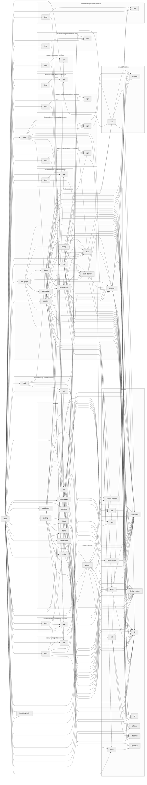

# Module Dependency Graph

```mermaid
%%{
  init: {
    'theme': 'neutral'
  }
}%%

graph LR
  subgraph :feature
    :feature:connections["connections"]
    :feature:dashboard["dashboard"]
    :feature:destinations["destinations"]
    :feature:locale["locale"]
    :feature:nutrition["nutrition"]
    :feature:poi["poi"]
    :feature:profile["profile"]
    :feature:settings["settings"]
    :feature:theme["theme"]
  end
  subgraph :feature:bridge:connection-session
    :feature:bridge:connection-session:api["api"]
    :feature:bridge:connection-session:impl["impl"]
  end
  subgraph :feature:bridge:destination-nutrition
    :feature:bridge:destination-nutrition:api["api"]
    :feature:bridge:destination-nutrition:impl["impl"]
  end
  subgraph :feature:bridge:destination-poi
    :feature:bridge:destination-poi:api["api"]
    :feature:bridge:destination-poi:impl["impl"]
  end
  subgraph :feature:bridge:destination-session
    :feature:bridge:destination-session:api["api"]
    :feature:bridge:destination-session:impl["impl"]
  end
  subgraph :feature:bridge:nutrition-session
    :feature:bridge:nutrition-session:api["api"]
    :feature:bridge:nutrition-session:impl["impl"]
  end
  subgraph :feature:bridge:nutrition-settings
    :feature:bridge:nutrition-settings:api["api"]
    :feature:bridge:nutrition-settings:impl["impl"]
  end
  subgraph :feature:bridge:poi-settings
    :feature:bridge:poi-settings:api["api"]
    :feature:bridge:poi-settings:impl["impl"]
  end
  subgraph :feature:bridge:profile-session
    :feature:bridge:profile-session:api["api"]
    :feature:bridge:profile-session:impl["impl"]
  end
  subgraph :feature:bridge:session-settings
    :feature:bridge:session-settings:api["api"]
    :feature:bridge:session-settings:impl["impl"]
  end
  subgraph :feature:bridge:session-strava
    :feature:bridge:session-strava:api["api"]
    :feature:bridge:session-strava:impl["impl"]
  end
  subgraph :feature:integrations:strava
    :feature:integrations:strava:api["api"]
    :feature:integrations:strava:impl["impl"]
  end
  subgraph :feature:sensor
    :feature:sensor:power["power"]
  end
  subgraph :feature:session
    :feature:session:nav-graph["nav-graph"]
    :feature:session:completion["completion"]
    :feature:session:history["history"]
    :feature:session:share["share"]
    :feature:session:stats-display["stats-display"]
    :feature:session:data["data"]
    :feature:session:init["init"]
    :feature:session:tracking["tracking"]
    :feature:session:domain["domain"]
    :feature:session:route-render["route-render"]
  end
  subgraph :shared
    :shared:concurrent["concurrent"]
    :shared:design-system["design-system"]
    :shared:di["di"]
    :shared:ble["ble"]
    :shared:error["error"]
    :shared:id["id"]
    :shared:sensor-protocol["sensor-protocol"]
    :shared:altitude["altitude"]
    :shared:distance["distance"]
    :shared:init["init"]
    :shared:map["map"]
    :shared:observability["observability"]
    :shared:graphics["graphics"]
    :shared:gpx["gpx"]
  end
  subgraph :shared:location
    :shared:location:data["data"]
    :shared:location:domain["domain"]
  end
  :feature:connections --> :shared:concurrent
  :feature:connections --> :shared:design-system
  :feature:connections --> :shared:di
  :feature:connections --> :feature:sensor:power
  :feature:connections --> :shared:ble
  :feature:connections --> :shared:error
  :feature:connections --> :shared:id
  :feature:connections --> :shared:sensor-protocol
  :feature:session:nav-graph --> :shared:concurrent
  :feature:session:nav-graph --> :shared:design-system
  :feature:session:nav-graph --> :shared:di
  :feature:session:nav-graph --> :feature:session:completion
  :feature:session:nav-graph --> :feature:session:history
  :feature:session:nav-graph --> :feature:session:share
  :feature:session:nav-graph --> :feature:session:stats-display
  :app --> :baselineprofile
  :app --> :feature:connections
  :app --> :feature:bridge:connection-session:api
  :app --> :feature:bridge:connection-session:impl
  :app --> :feature:bridge:destination-nutrition:api
  :app --> :feature:bridge:destination-nutrition:impl
  :app --> :feature:bridge:destination-poi:api
  :app --> :feature:bridge:destination-poi:impl
  :app --> :feature:bridge:destination-session:api
  :app --> :feature:bridge:destination-session:impl
  :app --> :feature:bridge:nutrition-session:api
  :app --> :feature:bridge:nutrition-session:impl
  :app --> :feature:bridge:nutrition-settings:api
  :app --> :feature:bridge:nutrition-settings:impl
  :app --> :feature:bridge:poi-settings:api
  :app --> :feature:bridge:poi-settings:impl
  :app --> :feature:bridge:profile-session:api
  :app --> :feature:bridge:profile-session:impl
  :app --> :feature:bridge:session-settings:api
  :app --> :feature:bridge:session-settings:impl
  :app --> :feature:bridge:session-strava:api
  :app --> :feature:bridge:session-strava:impl
  :app --> :feature:dashboard
  :app --> :feature:destinations
  :app --> :feature:integrations:strava:api
  :app --> :feature:integrations:strava:impl
  :app --> :feature:locale
  :app --> :feature:nutrition
  :app --> :feature:poi
  :app --> :feature:profile
  :app --> :feature:sensor:power
  :app --> :feature:session:data
  :app --> :feature:session:init
  :app --> :feature:session:nav-graph
  :app --> :feature:session:tracking
  :app --> :feature:settings
  :app --> :feature:theme
  :app --> :shared:altitude
  :app --> :shared:ble
  :app --> :shared:concurrent
  :app --> :shared:design-system
  :app --> :shared:di
  :app --> :shared:distance
  :app --> :shared:id
  :app --> :shared:init
  :app --> :shared:location:data
  :app --> :shared:error
  :app --> :shared:map
  :app --> :shared:observability
  :app --> :shared:sensor-protocol
  :feature:session:tracking --> :feature:session:domain
  :feature:session:tracking --> :feature:session:route-render
  :feature:session:tracking --> :shared:concurrent
  :feature:session:tracking --> :shared:design-system
  :feature:session:tracking --> :shared:di
  :feature:session:tracking --> :feature:session:stats-display
  :feature:session:tracking --> :shared:error
  :feature:session:tracking --> :shared:location:domain
  :feature:session:tracking --> :shared:location:data
  :feature:session:tracking --> :feature:bridge:connection-session:api
  :feature:session:tracking --> :feature:bridge:nutrition-session:api
  :feature:session:tracking --> :feature:theme
  :feature:session:tracking --> :feature:integrations:strava:api
  :feature:session:tracking --> :feature:session:data
  :feature:session:domain --> :shared:altitude
  :feature:session:domain --> :shared:concurrent
  :feature:session:domain --> :shared:distance
  :feature:session:domain --> :shared:id
  :feature:session:domain --> :shared:location:domain
  :feature:session:domain --> :feature:bridge:profile-session:api
  :feature:session:route-render --> :feature:session:domain
  :feature:session:route-render --> :shared:concurrent
  :feature:session:route-render --> :shared:design-system
  :feature:session:route-render --> :shared:di
  :feature:session:route-render --> :feature:session:stats-display
  :feature:session:route-render --> :shared:map
  :feature:session:route-render --> :feature:session:data
  :feature:dashboard --> :feature:destinations
  :feature:dashboard --> :feature:bridge:destination-session:api
  :feature:dashboard --> :shared:design-system
  :feature:nutrition --> :shared:concurrent
  :feature:nutrition --> :shared:design-system
  :feature:nutrition --> :shared:di
  :feature:nutrition --> :feature:bridge:nutrition-session:api
  :shared:map --> :shared:graphics
  :feature:session:completion --> :feature:session:domain
  :feature:session:completion --> :feature:session:route-render
  :feature:session:completion --> :shared:concurrent
  :feature:session:completion --> :shared:design-system
  :feature:session:completion --> :shared:di
  :feature:session:completion --> :feature:session:stats-display
  :feature:session:completion --> :shared:error
  :feature:session:completion --> :shared:graphics
  :feature:session:completion --> :shared:location:domain
  :feature:session:completion --> :shared:map
  :feature:session:completion --> :feature:session:data
  :shared:observability --> :shared:concurrent
  :feature:sensor:power --> :shared:concurrent
  :feature:sensor:power --> :shared:design-system
  :feature:sensor:power --> :shared:di
  :feature:sensor:power --> :shared:ble
  :feature:sensor:power --> :shared:error
  :feature:sensor:power --> :shared:sensor-protocol
  :baselineprofile --> :shared:design-system
  :baselineprofile --> :app
  :feature:bridge:nutrition-settings:impl --> :feature:bridge:nutrition-settings:api
  :feature:bridge:nutrition-settings:impl --> :feature:nutrition
  :feature:bridge:poi-settings:impl --> :feature:bridge:poi-settings:api
  :feature:bridge:poi-settings:impl --> :feature:poi
  :feature:profile --> :shared:concurrent
  :feature:profile --> :shared:di
  :feature:bridge:destination-nutrition:impl --> :feature:bridge:destination-nutrition:api
  :feature:bridge:destination-nutrition:impl --> :feature:nutrition
  :feature:bridge:session-strava:api --> :shared:gpx
  :feature:bridge:session-strava:impl --> :feature:bridge:session-strava:api
  :feature:bridge:session-strava:impl --> :feature:session:domain
  :feature:bridge:session-strava:impl --> :feature:session:share
  :feature:bridge:session-strava:impl --> :shared:gpx
  :feature:bridge:profile-session:impl --> :feature:bridge:profile-session:api
  :feature:bridge:profile-session:impl --> :feature:profile
  :feature:bridge:destination-poi:impl --> :feature:bridge:destination-poi:api
  :feature:bridge:destination-poi:impl --> :feature:poi
  :feature:settings --> :shared:concurrent
  :feature:settings --> :shared:design-system
  :feature:settings --> :shared:di
  :feature:settings --> :feature:theme
  :feature:settings --> :feature:locale
  :feature:settings --> :feature:profile
  :feature:settings --> :feature:bridge:nutrition-settings:api
  :feature:settings --> :feature:bridge:poi-settings:api
  :feature:settings --> :feature:bridge:session-settings:api
  :feature:settings --> :feature:integrations:strava:api
  :feature:bridge:destination-session:api --> :shared:location:domain
  :feature:session:init --> :feature:session:domain
  :feature:session:init --> :shared:concurrent
  :feature:session:init --> :shared:design-system
  :feature:session:init --> :shared:di
  :feature:session:init --> :feature:session:data
  :feature:session:init --> :shared:altitude
  :feature:session:init --> :shared:distance
  :feature:session:init --> :shared:error
  :feature:session:init --> :shared:id
  :feature:session:init --> :shared:location:domain
  :feature:session:init --> :shared:location:data
  :feature:session:init --> :feature:bridge:profile-session:api
  :feature:bridge:destination-session:impl --> :feature:bridge:destination-session:api
  :feature:bridge:destination-session:impl --> :feature:session:domain
  :feature:bridge:destination-session:impl --> :feature:session:route-render
  :feature:bridge:destination-session:impl --> :feature:session:tracking
  :feature:bridge:destination-session:impl --> :shared:concurrent
  :feature:bridge:destination-session:impl --> :shared:location:domain
  :feature:bridge:destination-session:impl --> :feature:session:data
  :feature:integrations:strava:impl --> :shared:concurrent
  :feature:integrations:strava:impl --> :shared:design-system
  :feature:integrations:strava:impl --> :shared:di
  :feature:integrations:strava:impl --> :shared:gpx
  :feature:integrations:strava:impl --> :feature:integrations:strava:api
  :feature:integrations:strava:impl --> :feature:bridge:session-strava:api
  :feature:bridge:connection-session:impl --> :feature:bridge:connection-session:api
  :feature:bridge:connection-session:impl --> :feature:connections
  :feature:bridge:connection-session:impl --> :feature:sensor:power
  :feature:bridge:nutrition-session:impl --> :feature:nutrition
  :feature:bridge:nutrition-session:impl --> :feature:bridge:nutrition-session:api
  :feature:bridge:nutrition-session:impl --> :feature:session:domain
  :feature:bridge:session-settings:impl --> :feature:bridge:session-settings:api
  :feature:bridge:session-settings:impl --> :feature:session:stats-display
  :shared:error --> :shared:concurrent
  :shared:error --> :shared:design-system
  :shared:error --> :shared:di
  :feature:session:stats-display --> :feature:session:domain
  :feature:session:stats-display --> :shared:concurrent
  :feature:session:stats-display --> :shared:design-system
  :feature:session:stats-display --> :shared:di
  :feature:session:share --> :feature:session:domain
  :feature:session:share --> :feature:session:route-render
  :feature:session:share --> :shared:concurrent
  :feature:session:share --> :shared:design-system
  :feature:session:share --> :shared:di
  :feature:session:share --> :feature:session:stats-display
  :feature:session:share --> :shared:gpx
  :feature:session:share --> :shared:location:domain
  :feature:session:share --> :feature:integrations:strava:api
  :feature:session:share --> :feature:session:data
  :shared:location:data --> :shared:location:domain
  :shared:location:data --> :shared:concurrent
  :shared:location:data --> :shared:di
  :feature:theme --> :shared:concurrent
  :feature:theme --> :shared:di
  :shared:ble --> :shared:concurrent
  :feature:locale --> :shared:concurrent
  :feature:locale --> :shared:di
  :shared:init --> :shared:altitude
  :shared:init --> :shared:concurrent
  :shared:init --> :shared:di
  :shared:init --> :shared:distance
  :shared:init --> :shared:id
  :feature:session:data --> :feature:session:domain
  :feature:session:data --> :shared:concurrent
  :feature:session:data --> :shared:di
  :feature:destinations --> :shared:concurrent
  :feature:destinations --> :shared:design-system
  :feature:destinations --> :shared:di
  :feature:destinations --> :feature:bridge:destination-nutrition:api
  :feature:destinations --> :feature:bridge:destination-poi:api
  :feature:destinations --> :feature:bridge:destination-session:api
  :feature:destinations --> :shared:distance
  :feature:destinations --> :shared:graphics
  :feature:destinations --> :shared:location:data
  :feature:destinations --> :shared:map
  :feature:session:history --> :feature:session:domain
  :feature:session:history --> :shared:concurrent
  :feature:session:history --> :shared:design-system
  :feature:session:history --> :shared:di
  :feature:session:history --> :feature:session:stats-display
  :feature:session:history --> :feature:session:data
  :feature:poi --> :shared:concurrent
  :feature:poi --> :shared:design-system
  :feature:poi --> :shared:di
```