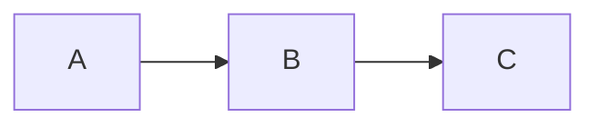

# Documentation

This site is built with [MkDocs Material](https://squidfunk.github.io/mkdocs-material/) and deployed to GitHub Pages.

## Prerequisites

- Python 3.x
- pip

## Local Development

### Install dependencies

```bash
pip install mkdocs-material
```

### Start local preview

```bash
mkdocs serve
python -m mkdocs serve
```

Open [http://localhost:8000](http://localhost:8000) to preview the site. Changes to `.md` files and `mkdocs.yml` are reflected in real time.

### Build the site

```bash
mkdocs build
```

This generates the static site in the `site/` directory (git-ignored).

## Deployment

The docs are auto-deployed via the `deploy-docs.yml` GitHub Actions workflow on every push to `main` that changes files in `docs/` or `mkdocs.yml`. The workflow can also be triggered manually via `workflow_dispatch`.

The workflow uses the modern GitHub Pages approach with `actions/upload-pages-artifact` and `actions/deploy-pages`.

!!! note "One-time setup"
    The repository must have GitHub Pages configured to use **GitHub Actions** as the source: Settings > Pages > Source > GitHub Actions.

## Module Graph

The `docs/MODULE_GRAPH.md` file is auto-generated by the `update-module-graph` CI workflow on each push to `main`. Do not edit it manually — changes will be overwritten.

The module graph is included inline in the [Module Structure](../architecture/module-structure.md) page using `pymdownx.snippets`.

## Adding New Pages

1. Create a new `.md` file in the appropriate `docs/` subdirectory
2. Add the page to the `nav:` section in `mkdocs.yml`
3. Push to `main` — the site will rebuild automatically

## Available Features

### Mermaid Diagrams

Use fenced code blocks with the `mermaid` language:

````markdown

````

### Admonitions

```markdown
!!! note "Title"
    Content of the admonition.

!!! warning
    Warning content.
```

### Tabbed Content

```markdown
=== "Tab 1"
    Content for tab 1.

=== "Tab 2"
    Content for tab 2.
```

### Code Blocks

Code blocks support syntax highlighting, line numbers, and a copy button:

````markdown
```kotlin
fun hello() {
    println("Hello, world!")
}
```
````
