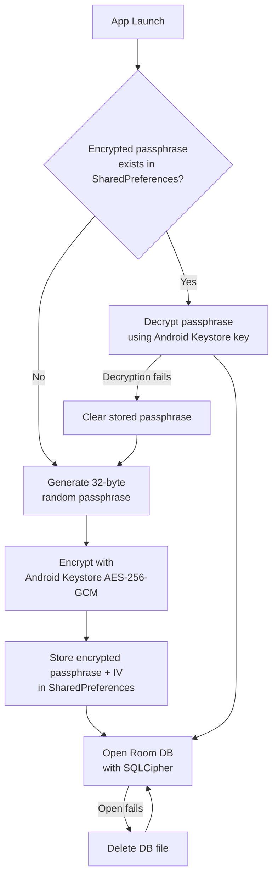

# Security

## Database Encryption

### Why

The Room database stores user sessions, track points, profile settings, and locale preferences.
On a rooted device or via ADB backup, an unencrypted SQLite file can be read directly. SQLCipher
encrypts the entire database file at rest using AES-256, making the data unreadable without the
passphrase.

### How It Works



**Components:**

| Component | Location | Responsibility |
|-----------|----------|----------------|
| `DatabasePassphraseManager` | `app/data/` | Interface for passphrase retrieval |
| `DatabasePassphraseManagerImpl` | `app/data/` | Passphrase generation, encryption, decryption, recovery |
| `RoomDatabaseFactory` | `app/data/` | Builds encrypted Room DB, handles corrupt DB recovery |
| `SupportOpenHelperFactory` | SQLCipher library | Plugs into Room's `openHelperFactory` |

**Passphrase lifecycle:**

1. On first launch, a 32-byte random passphrase is generated via `SecureRandom`
2. The passphrase is encrypted using an AES-256-GCM key stored in Android Keystore
3. The encrypted passphrase and IV are saved to a dedicated `SharedPreferences` file
4. On subsequent launches, the passphrase is decrypted from storage and passed to SQLCipher

### Debug vs Release

Encryption is **disabled in debug builds** so that Android Studio's App Inspector (Database
Inspector) can read the database for development and debugging. The `RoomDatabaseFactory` receives
an `isEncryptionEnabled` flag from DI, set to `!BuildConfig.DEBUG`.

In release builds, SQLCipher is loaded and the encrypted passphrase is used. In debug builds,
Room opens a standard unencrypted SQLite database.

If a device switches between debug and release builds, `recoverIfCorrupted()` detects the format
mismatch, deletes the old database file, and rebuilds fresh.

### R8/ProGuard

SQLCipher native classes are kept from obfuscation:

```
-keep class net.zetetic.database.** { *; }
```

## Keystore Recovery

### Why

Android Keystore keys can be lost in rare scenarios: OS updates, device-specific firmware bugs,
or factory reset without backup. If the Keystore key is gone, the encrypted passphrase stored in
SharedPreferences can no longer be decrypted — the app would crash on every launch with no
recovery path.

### How It Works

`DatabasePassphraseManagerImpl.recoverOrRegenerate()` wraps the decryption call in a catch-all:

- `AEADBadTagException` — Keystore key was wiped, new key can't decrypt old data
- `IllegalArgumentException` — corrupted Base64 in SharedPreferences
- `BadPaddingException` — corrupted encrypted payload
- `InvalidAlgorithmParameterException` — wrong IV size

On any failure:

1. Stored passphrase and IV are cleared from SharedPreferences
2. A new passphrase is generated and stored
3. The old database is now unreadable with the new passphrase

`RoomDatabaseFactory.recoverIfCorrupted()` handles the second half — it force-opens the database
and if SQLCipher fails (passphrase mismatch), deletes the database file and rebuilds from scratch.
`fallbackToDestructiveMigration` does **not** help here because SQLCipher fails at open time,
before Room checks the schema version.

Data loss (sessions, profile, locale settings) is unavoidable but accepted over a crash loop.
Destination data is re-seeded on empty database by `InitializeDatabaseUseCase`.

## Backup Exclusions

### Why

If the encrypted database or passphrase prefs are backed up to Google Drive and restored on a
different device (or after a factory reset), the Android Keystore key won't exist on the target
device. The restored passphrase can't be decrypted, triggering the recovery flow and making the
restored database useless. Excluding these files avoids silent data corruption after restore.

### How It Works

Two XML rule files exclude the database and passphrase prefs from both cloud backup and device
transfer:

**`backup_rules.xml`** (Android 11 and below):

```xml
<full-backup-content>
    <exclude domain="database" path="cycling_assistant_db" />
    <exclude domain="database" path="cycling_assistant_db-shm" />
    <exclude domain="database" path="cycling_assistant_db-wal" />
    <exclude domain="database" path="cycling_assistant_db-journal" />
    <exclude domain="sharedpref" path="db_passphrase_prefs.xml" />
</full-backup-content>
```

**`data_extraction_rules.xml`** (Android 12+):

```xml
<data-extraction-rules>
    <cloud-backup>
        <exclude domain="database" path="cycling_assistant_db" />
        <!-- shm, wal, journal also excluded -->
        <exclude domain="sharedpref" path="db_passphrase_prefs.xml" />
    </cloud-backup>
    <device-transfer>
        <!-- same exclusions -->
    </device-transfer>
</data-extraction-rules>
```

## APK Size Impact

SQLCipher bundles native `.so` libraries (compiled OpenSSL + SQLCipher C code) for each supported
ABI architecture. This adds approximately **22 MB** to the universal APK:

| ABI | Approx. Size |
|-----|-------------|
| arm64-v8a | ~5.5 MB |
| armeabi-v7a | ~4.5 MB |
| x86_64 | ~6 MB |
| x86 | ~6 MB |

When distributing via **Android App Bundle (AAB)** on Google Play, each user only downloads the
native library matching their device architecture. The actual download size increase per user is
**~5-6 MB** (typically arm64-v8a on modern devices).

No ABI filtering is applied in the build configuration — all four architectures are included to
maintain emulator support in release builds and full device compatibility.

## Summary

| Technique | Threat | Protection |
|-----------|--------|------------|
| SQLCipher (AES-256) | Physical device access, ADB extraction | Database file unreadable without passphrase |
| Android Keystore (AES-256-GCM) | App data extraction | Passphrase encrypted at rest, key in hardware-backed store |
| Keystore recovery | Key loss (OS bug, factory reset) | Regenerate passphrase, delete and rebuild DB |
| Backup exclusions | Cross-device restore, cloud leak | DB files and passphrase prefs excluded from backup |
| Debug bypass | Developer tooling (App Inspector) | Encryption disabled in debug builds only |
| R8 keep rules | Obfuscation breaking SQLCipher | Native classes preserved from minification |

Database initialization is handled off the main thread via `ConcurrentFactory` — see
[Concurrency](concurrency.md#database-initialization).
