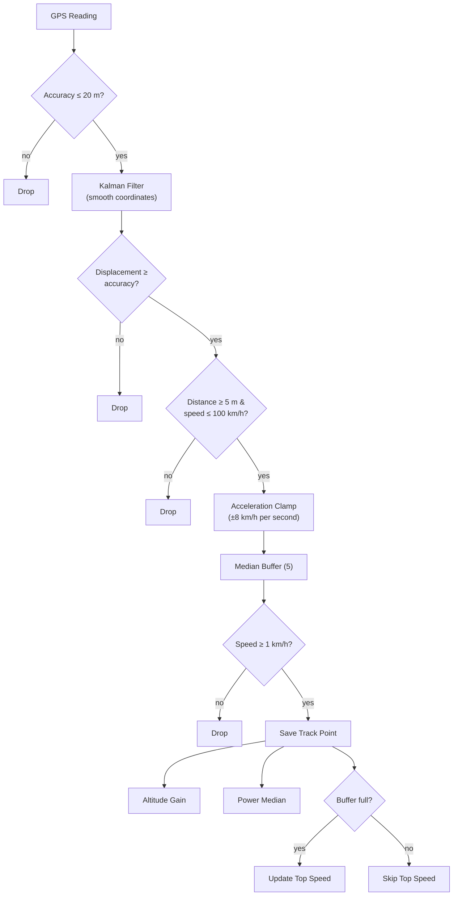

# Evolution: Location Processing

!!! info "Timeline"
    January – March 2026 · 4 major versions

## Overview

Location processing in CyclingAssistant evolved from raw GPS recording to a multi-stage pipeline
with Kalman filtering, median speed smoothing, and acceleration clamping. Each version addressed
specific real-world problems discovered during field testing.


## Version Mapping

| Version | App Release | Key Commits |
|---------|-------------|-------------|
| V1 Raw | pre-release | `2997ace` initial session implementation |
| V2 Filtered | **v1.1.0** | `be2af81` location drifting, `3a4ba31` altitude gain |
| V3 Kalman + Median | **v1.1.0** | `7f277c5` Kalman smoother, `15031bb` speed buffer + clamping readouts |
| V4 Full Pipeline | **v1.5.0** | `ae46bfe` acceleration clamping, speed warmup |
| V4 (continued) | **v1.8.0** | `1c54f44` power meter integration, `dbc87ab` HW-buffered points |

!!! note
    V1 through V3 were developed iteratively on feature branches before the first public release.
    All three stages shipped together in **v1.1.0** — the first version with session tracking.
    V4 refinements were applied incrementally in later releases as field testing revealed edge cases.

## Feature Matrix

| Feature | V1 | V2 | V3 | V4 |
|---------|:--:|:--:|:--:|:--:|
| GPS accuracy validation | — | 20 m | 20 m | 20 m |
| Minimum displacement | — | 5 m | 5 m | 5 m |
| Maximum speed cap | 100 km/h | 100 km/h | 100 km/h | 100 km/h |
| Displacement vs accuracy check | — | — | yes | yes |
| Kalman filter (coordinates) | — | — | yes | yes |
| Speed median buffer | — | — | 5 samples | 5 samples |
| Stationary threshold | — | — | 1 km/h | 1 km/h |
| Acceleration clamping | — | — | — | ±8 km/h/s |
| Top speed warmup | — | — | — | 5 samples |
| Altitude gain tracking | — | yes | yes | yes |
| Power meter integration | — | — | — | yes |
| HW-buffered points | — | — | — | yes |

---

## V1 — Raw Recording { #v1 }

!!! info ""
    **App version:** pre-release (development only)

!!! abstract "Problem"
    The initial implementation had no filtering. Every GPS reading was recorded as-is, producing
    noisy routes and erratic speed readouts on the map.

### Algorithm

```
for each GPS reading:
    distance = haversine(previous, current)      ← raw coordinates
    speed    = distance / timeDelta
    if speed ≤ 100 km/h:
        record track point
```

No accuracy validation, no smoothing, no minimum displacement threshold. The only guard was a
100 km/h upper speed cap to discard obviously invalid teleport-like readings.

### Characteristics

- Route polyline closely follows raw GPS scatter
- Speed values jump erratically between readings
- Stationary drift is recorded as movement (GPS wander adds phantom distance)
- Top speed is inflated by GPS noise spikes

### Route Comparison

<!-- TODO: Add screenshot of V1 route -->
<div class="screenshot-grid">
<figure>
  
  <figcaption>V1 — Raw GPS route</figcaption>
</figure>
</div>

---

## V2 — Basic Filtering { #v2 }

!!! info ""
    **App version:** v1.1.0

!!! abstract "Problem"
    V1 routes showed GPS drift when stationary and occasional teleport jumps when accuracy
    dropped. Distance and speed statistics were unreliable.

### Changes from V1

- **GPS accuracy validation** — reject readings with accuracy > 20 m
- **Minimum displacement** — skip if distance from previous point < 5 m
- **Altitude gain tracking** — accumulate altitude gains > 1 m threshold

### Algorithm

```
for each GPS reading:
    if accuracy > 20 m → skip
    distance = haversine(previous, current)      ← still raw coordinates
    speed    = distance / timeDelta
    if distance < 5 m or speed > 100 km/h → skip
    altitudeGain = max(0, current.alt - previous.alt) if > 1 m
    record track point
```

### Characteristics

- Stationary drift is mostly eliminated (5 m threshold)
- Low-accuracy readings from tunnels / urban canyons are rejected
- Speed still jumps between readings (no temporal smoothing)
- Route follows raw coordinates — still shows GPS scatter in open areas

### Route Comparison

<!-- TODO: Add screenshot of V2 route -->
<div class="screenshot-grid">
<figure>
  
  <figcaption>V2 — Filtered route</figcaption>
</figure>
</div>

---

## V3 — Kalman Filter + Median Speed { #v3 }

!!! info ""
    **App version:** v1.1.0

!!! abstract "Problem"
    V2 filtering removed the worst outliers, but routes still showed GPS scatter — the polyline
    zigzagged around the actual path. Speed readouts fluctuated between consecutive readings
    even at constant velocity.

### Changes from V2

- **Kalman filter** — 1D per axis (latitude, longitude) smooths coordinate noise
- **Displacement vs accuracy check** — skip if displacement < GPS accuracy (error band)
- **Median speed buffer** — 5-sample moving median for stable speed readouts
- **Stationary threshold** — discard speeds below 1 km/h
- **Segment awareness** — reset smoother and buffers on pause/resume boundaries

### Kalman Filter

Coordinates are converted to a local metric frame (meters from the first observed point) so the
filter operates in meters and the Kalman gain has physical meaning.

```
State model (per axis):
    State:       position in meters from reference origin
    Prediction:  constant position, uncertainty grows by 3.0 m²/s × dt
    Measurement: GPS accuracy² (variance in m²)
    Gain:        K = P_predicted / (P_predicted + R)
```

**Example — stationary device (3 s interval):**

| # | GPS lat | Accuracy | K | Smoothed lat | Effect |
|---|---------|----------|---|-------------|--------|
| 1 | 50.00000 | 10 m | — | 50.00000 | First reading (init) |
| 2 | 50.00010 | 10 m | 0.52 | 50.00005 | Splits the difference |
| 3 | 50.00050 | 50 m | 0.02 | 50.00006 | Noisy spike nearly ignored |
| 4 | 50.00006 | 5 m | 0.73 | 50.00006 | Accurate fix, converges |

### Speed Median Buffer

Raw speed goes directly into a 5-sample buffer. The median is taken as the smoothed speed:

```
buffer = [12.3, 14.1, 13.5, 40.2, 13.8]   ← one GPS spike
sorted = [12.3, 13.5, 13.8, 14.1, 40.2]
median = 13.8 km/h                          ← spike rejected
```

Without acceleration clamping, a sustained sequence of noisy readings can still shift the median
upward, since all 5 buffer values may be inflated before the median corrects.

### Characteristics

- Route polyline is significantly smoother — follows the actual road
- Speed readouts are stable at constant velocity
- Occasional speed spikes still appear when multiple noisy readings enter the buffer simultaneously
- Top speed is only updated after 5 buffer samples (warmup)

### Route Comparison

<!-- TODO: Add screenshot of V3 route -->
<div class="screenshot-grid">
<figure>
  
  <figcaption>V3 — Kalman-smoothed route</figcaption>
</figure>
</div>

---

## V4 — Full Pipeline (Current) { #v4 }

!!! info ""
    **App version:** v1.5.0 (acceleration clamping, speed warmup) · v1.8.0 (power meter, HW-buffered points)

!!! abstract "Problem"
    V3 median smoothing handles isolated spikes well, but when GPS noise produces a burst of
    elevated speed readings (e.g., entering a tunnel then exiting), all 5 buffer slots fill with
    high values and the median climbs. The speed display shows unrealistic jumps that violate
    physics — a cyclist cannot accelerate from 15 to 50 km/h in one second.

### Changes from V3

- **Acceleration clamping** — limits speed change to ±8 km/h per second based on time delta
- **Power meter integration** — associates BLE power readings with track points temporally
- **Hardware-buffered points** — processes all buffered GPS points, not just the latest

### Acceleration Clamping

Before entering the median buffer, raw speed is clamped based on the last accepted speed and
elapsed time:

```kotlin
val maxDelta = MAX_ACCELERATION_KMH_PER_S * timeDiffSeconds   // 8.0 × dt
val lowerBound = (lastAcceptedSpeed - maxDelta).coerceAtLeast(0.0)
val upperBound = lastAcceptedSpeed + maxDelta
clampedSpeed = rawSpeed.coerceIn(lowerBound, upperBound)
```

**Example — GPS noise burst:**

| Reading | Raw speed | Time Δ | Bounds | Clamped | Median |
|---------|-----------|--------|--------|---------|--------|
| 1 | 15.0 | — | — | 15.0 | 15.0 |
| 2 | 60.0 | 5 s | [0, 55] | 55.0 | 35.0 |
| 3 | 80.0 | 5 s | [15, 95] | 80.0 | 55.0 |

Without clamping, readings 2 and 3 would enter the buffer at 60 and 80, pushing the median
much higher. With clamping, the speed can only ramp up at a physically plausible rate.

### Full Processing Pipeline



### Characteristics

- Speed readouts are physically consistent — no impossible jumps
- Route polyline is the smoothest across all versions
- Top speed reflects actual peak performance, not GPS noise
- Power meter data is temporally aligned with track points

### Route Comparison

<!-- TODO: Add screenshot of V4 route -->
<div class="screenshot-grid">
<figure>
  
  <figcaption>V4 — Full pipeline route</figcaption>
</figure>
</div>

---

## Side-by-Side Comparison

<!-- TODO: Add side-by-side comparison screenshots -->
<div class="screenshot-grid">
<figure>
  
  <figcaption>Route comparison — same ride, four processing versions</figcaption>
</figure>
</div>

<!-- TODO: Add speed chart comparison -->
<div class="screenshot-grid">
<figure>
  
  <figcaption>Speed readouts — same ride, four processing versions</figcaption>
</figure>
</div>

### Statistics Comparison

<!-- TODO: Fill with actual data from comparison session -->

| Metric | V1 Raw | V2 Filtered | V3 Kalman | V4 Current |
|--------|--------|-------------|-----------|------------|
| Track points | — | — | — | — |
| Total distance | — | — | — | — |
| Average speed | — | — | — | — |
| Top speed | — | — | — | — |
| Altitude gain | — | — | — | — |

---

## Key Files

| File | Purpose |
|------|---------|
| `feature/session/.../UpdateSessionLocationUseCase.kt` | Current V4 location processing |
| `shared/location/.../LocationSmoother.kt` | Kalman filter interface + implementation |
| `shared/location/.../LocationValidator.kt` | GPS accuracy validation |
| `shared/altitude/.../AltitudeCalculator.kt` | Altitude gain calculation |
| `shared/distance/.../DistanceCalculator.kt` | Haversine distance formula |
| `feature/session/.../LocationCollectionManager.kt` | Location flow subscription and delivery |

## Reproduction

The comparison use cases under `feature/session/.../comparison/` recreate V1–V3 algorithms
as standalone processors. Running a session produces four parallel recordings (one per version)
that can be compared in the session list.

| Processor | Class | Session ID suffix |
|-----------|-------|-------------------|
| V1 Raw | `V1RawComparisonLocationProcessor` | `_v1` |
| V2 Filtered | `V2FilteredComparisonLocationProcessor` | `_v2` |
| V3 Kalman | `V3KalmanComparisonLocationProcessor` | `_v3` |
| V4 Current | `UpdateSessionLocationUseCaseImpl` | _(main session)_ |
