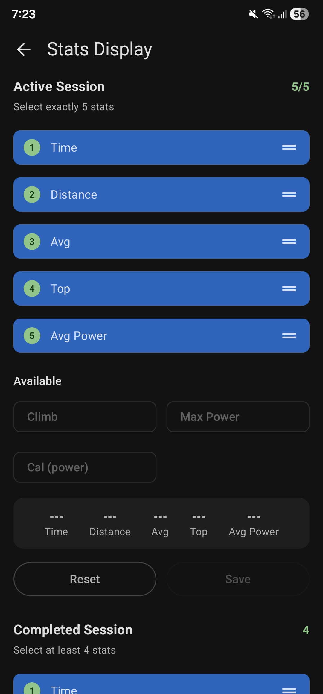
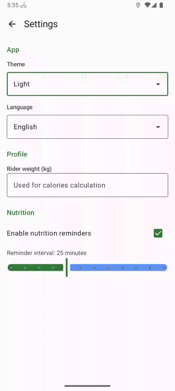

# Showcase

Screenshots and videos demonstrating CyclingAssistant features.

## Screenshots

<figure>
  
  <figcaption>Available session stats</figcaption>
</figure>
<figure>
  
  <figcaption>Random destination search</figcaption>
</figure>
<figure>
  
  <figcaption>Destination session start</figcaption>
</figure>
<figure>
  
  <figcaption>Running session flow</figcaption>
</figure>
<figure>
  
  <figcaption>App settings selection</figcaption>
</figure>

## Videos

<figure>
  <video width="280" controls muted>
    <source src="../showcase/video_active_session_card.mp4" type="video/mp4">
  </video>
  <figcaption>Realtime navigation during active session</figcaption>
</figure>
<figure>
  <video width="280" controls muted>
    <source src="../showcase/video_map_layers.mp4" type="video/mp4">
  </video>
  <figcaption>Layers observation on a completed session</figcaption>
</figure>
<figure>
  <video width="280" controls muted>
    <source src="../showcase/video_stats_selection.mp4" type="video/mp4">
  </video>
  <figcaption>Selection of active stats</figcaption>
</figure>

